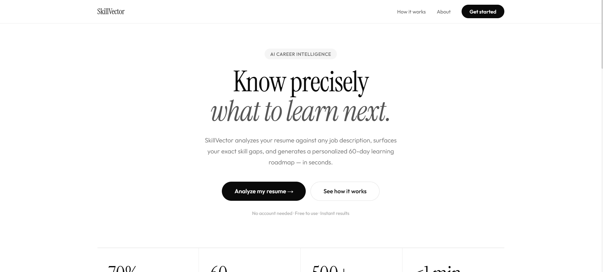
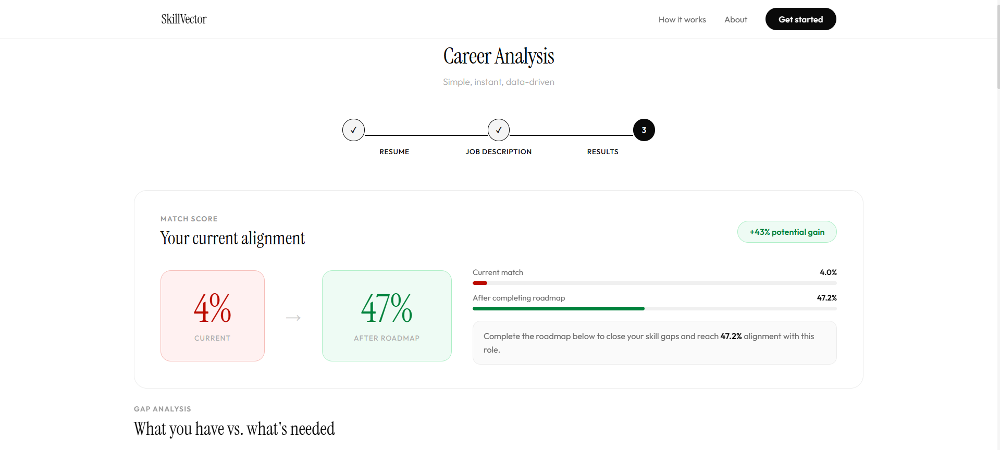
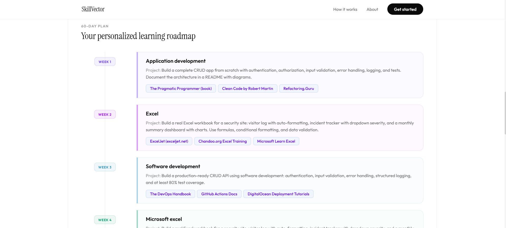

# 🧠 SkillVector

> AI-powered career intelligence engine that transforms resumes and job descriptions into quantified skill gap analysis and structured learning roadmaps.

🚀 Live Demo: [Coming Soon]  
📄 API Docs: `/docs`

---

## What It Does
- Extracts skills from resumes and job descriptions using NLP
- Computes match score via TF-IDF + cosine similarity
- Ranks missing skills using weighted frequency scoring
- Generates a prioritized learning roadmap
- Recalculates match score as progress updates

---

## Architecture
- Backend: FastAPI
- NLP: spaCy
- ML: scikit-learn (TF-IDF, cosine similarity)
- Frontend: React
- DB: PostgreSQL (optional)

---

## Why It’s Different
- Not a chatbot.
- Not prompt engineering.
- A deterministic, algorithm-driven decision engine.

---

## Quick Start
### Backend:
- cd backend
- pip install -r requirements.txt
- python -m spacy download en_core_web_sm
- uvicorn main:app --reload --port 8010

---

### Frontend:
- cd frontend
- npm install
- npm start

---

Backend: http://localhost:8010

Frontend: http://localhost:3000

## 📸 Preview

