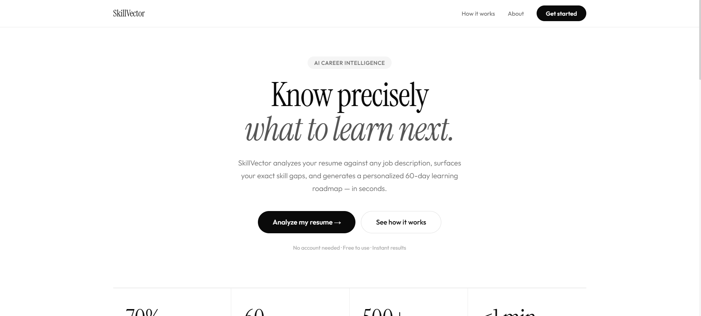
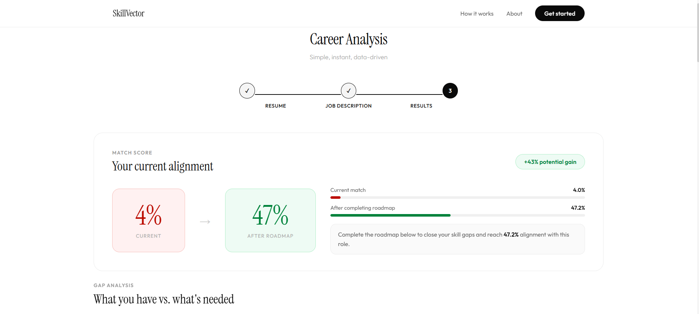
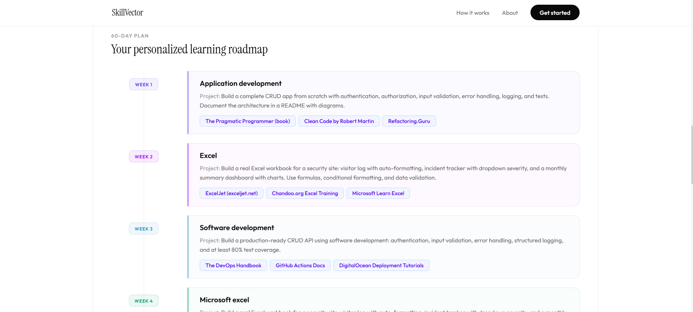

# 🧠 SkillVector

> AI career intelligence engine that converts resumes + job descriptions into quantified skill gap analysis and actionable learning roadmaps.

🚀 Live Demo: `https://skillvector-04vy.onrender.com/`  
📄 API Docs: `https://skillvector-nwm2.onrender.com/`  

---

## ⚡ What It Does

- Parses resumes and job descriptions using NLP  
- Computes match score via TF-IDF + cosine similarity  
- Identifies and ranks missing skills using weighted scoring  
- Generates structured, prioritized learning roadmaps  
- Dynamically recalculates match score as skills improve  

---

## 🏗️ Architecture

- **Backend:** FastAPI  
- **Frontend:** React  
- **Database:** PostgreSQL (Supabase)  
- **NLP:** spaCy  
- **ML:** scikit-learn (TF-IDF, cosine similarity)  
- **Deployment:** Render  

---

## 🧠 Core Idea

SkillVector is not a chatbot.

It’s a **deterministic decision engine** that:
- quantifies career gaps  
- ranks them algorithmically  
- outputs structured, data-driven guidance  

---

## Quick Start
### Backend:
- cd backend
- pip install -r requirements.txt
- python -m spacy download en_core_web_sm
- uvicorn main:app --reload --port 8010

---

### Frontend:
- cd frontend
- npm install
- npm start

---

Backend: http://localhost:8010

Frontend: http://localhost:3000

## 📸 Preview

